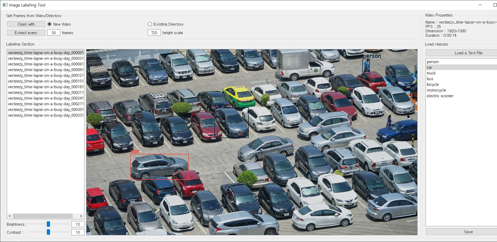
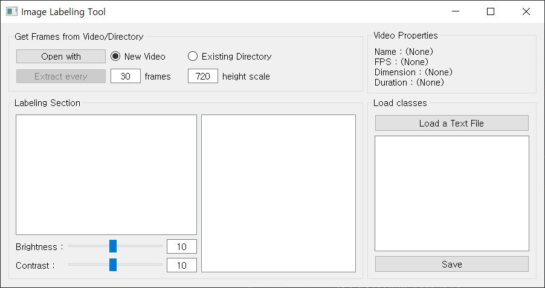
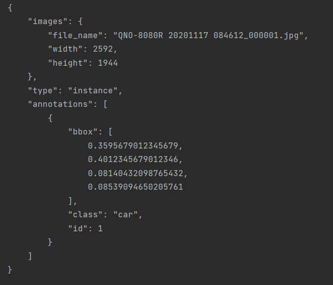

# Video Labeling Tool

이미지 속 영상 출처: https://www.vecteezy.com/video/2020994-time-lapse-on-a-parking-lot

 

## GUI 설명

### Get Frames from Video/Directory

- Open with: 레이블링을 할 영상 혹은 이전에 작업하던 폴더를 불러옴
  - New Video / Existing Directory: 가져올 것이 영상인지 폴더인지 선택
  
- Extract every: 영상 또는 폴더에서 이미지를 나눠서 가져옴
  - frames: 몇 프레임당 이미지를 가져올 것인지 정할 때 사용 (폴더 로드시 적용 X)
  - height scale: 이미지를 불러올때 최대 높이 크기를 지정
  
### Video Properties
- 영상의 이름, FPS, 한 프레임당 크기, 영상 길이를 표기

### Labeling Section
- 왼쪽 박스: 영상을 쪼갠 뒤 순서대로 인덱스를 붙여서 표기
  - 라벨링 작업 후 Save 버튼을 누르면 해당 이미지칸은 빨간색으로 표시
  - 작업 중인 폴더를 불러왔을 때, json 파일이 이미 있으면 노란색으로 표시
  - 작업 중인 폴더를 불러왔을 때, 이미지만 있으면 흰색으로 표시
- 오른쪽 박스: 선택한 프레임의 이미지 출력
- Brightness: 이미지의 밝기 조절
- Contrast: 이미지의 대조 조절

### Load classes
- Load a Text File: 사용할 label class를 저장한 텍스트 파일 불러오기
- 중간 박스: class 표시
- Save: 라벨링이 끝난 이미지를 json 파일로 저장
 
 

## 동작 설명

### Mouse

Mouse Left Click - 레이블링 박스 선택
  - 선택 후 클래스 리스트에서 다른 클래스 선택 시 클래스 변경 가능
  - 박스 이외의 곳 클릭시 선택 해제 가능
  
Mouse Left Drag - 레이블렝 수행
  - 선택된 레이블링 박스 이동 및 크기 조절

Mouse Wheel - 이미지 확대 축소

Mouse Right Drag - 이미지 이동

### Keyboard

방향키 - Mouse Right Drag와 같은 동작 수행

W, S - 현재 선택된 클래스 변경

A, D - 이전 혹은 다음 프레임에 해당하는 이미지로 이동
  - 프레임 이동 시 자동으로 Save 버튼 동작 실행

Del - 선택된 레이블렝 박스 삭제

 

## 저장 형식

### 다음과 같은 형식으로 json 파일로 저장 

